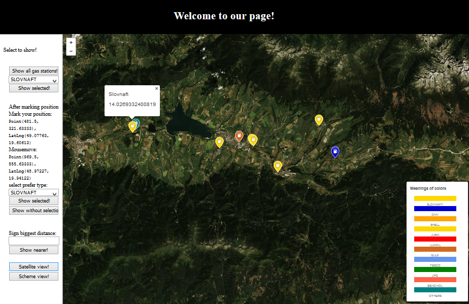
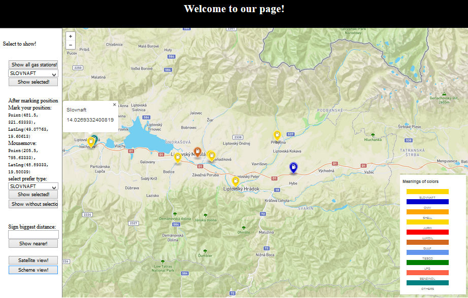

# General course assignment

Build a map-based application, which lets the user see geo-based data on a map and filter/search through it in a meaningfull way. Specify the details and build it in your language of choice. The application should have 3 components:

1. Custom-styled background map, ideally built with [mapbox](http://mapbox.com). Hard-core mode: you can also serve the map tiles yourself using [mapnik](http://mapnik.org/).
2. Local server with [PostGIS](http://postgis.net/) and an API layer that exposes data in a [geojson format](http://geojson.org/).
3. The user-facing application (web, android, ios, your choice..) which calls the API and lets the user see and navigate in the map and shows the geodata. You can (and should) use existing components, such as the Mapbox SDK, or [Leaflet](http://leafletjs.com/).

## Example projects

- Showing nearby landmarks as colored circles, each type of landmark has different circle color and the more interesting the landmark is, the bigger the circle. Landmarks are sorted in a sidebar by distance to the user. It is possible to filter only certain landmark types (e.g., castles).

- Showing bicykle roads on a map. The roads are color-coded based on the road difficulty. The user can see various lists which help her choose an appropriate road, e.g. roads that cross a river, roads that are nearby lakes, roads that pass through multiple countries, etc.

## Data sources

- [Geofabric](http://download.geofabrik.de/)

## My project

Fork this repository and fill in:

**Application description**: `Application shows gas stations in Slovak Republic. You can choose what you want to see. It is possible to find all gas stations or selected type of gas stations, for example: Slovnaft, OMV, LPG, etc. 
You can also mark your position on map and the application will show you 10 nearest gas stations. There are also possibility to select prefered type of station or biggest distance, which could be between you and station. You can also see a legend with description of colors of markers shown in the map. When you click on the each marker, the type of gas station and distance between you in kilometers will be showen.`

This is it in action:






The picture shows finding nearest gas stations around Liptovský Mikuláš. Clicked marker shows name of the gas station and its distance from point marked by user.

**Data source**: `geofabric`

**Technologies used**: `python, javascritp, postgis, postresql`


The application has 2 separate parts, the client which is a [frontend web application](#frontend) using mapbox API and mapbox.js and the [backend application](#backend) written in Python, backed by PostGIS. The frontend application communicates with backend using library psycopg2. By using this library we can open connection with DB and execute queries in SQL language.

# Frontend

The frontend application is a static HTML page (`index.html`), which shows a mapbox.js widget. It is displaying results from this application to the end-user. I make styles for markers acording to the names of gas stations. I tried to find suitable color for their sing. When user wants to find the nearest gas station through marker the distance is displayed. 

All relevant frontend code is in index.html in section `<script>...</script>`. The frontend code is very simple, its only responsibilities are:
- displaying the sidebar panel with options of user to select, driving the user interaction and calling the appropriate backend APIs
- displaying geo features by overlaying the map with a geojson layer, the geojson is provided directly by backend APIs

# Backend

The backend application is written in Python and there are executed quries through library mentined earlier. It helps with working with geo data and formatting them to the geojson.

## Data

Data is coming directly from [Geofabric](http://download.geofabrik.de/). I downloaded an extent covering whole Slovakia (around 171 MB - slovakia.latest.osm.pbf) and imported it using the `osm2pgsql` tool into the standard OSM schema in WGS 84 with hstore enabled.

## Api

**Show stations around the point**

`myLayer.loadURL("/select3?lng="+lng+"&lat="+lat);`

**Show stations with selected name and around the marked point**

`myLayer.loadURL("/select5?name="+nameGS2+"&lng="+lng+"&lat="+lat);`

### Response

Response is in a geojson, which contains type, geometry and properties for each gas station. Thanks to them we can display metched gas stations with corresponding markers.
```
{
  "type":"Feature",
  "geometry":
           {"type":"Point",
            "coordinates":[21.9835715431414,48.4317157985238]},
   "properties":{"f1":34149384,"f2":"Slovnaft","f3":4165.5993062999}
}
```
